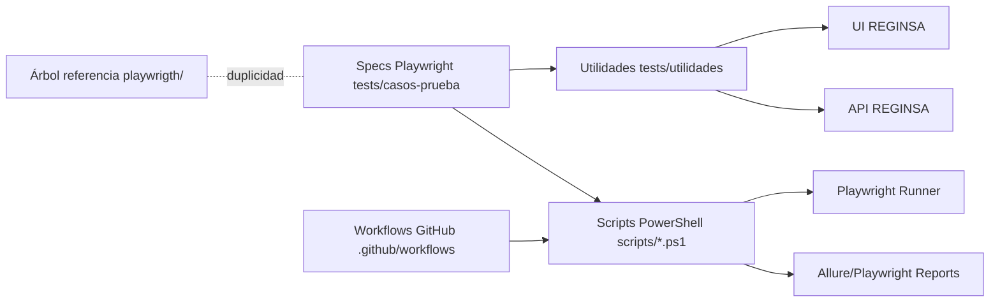

# AUDITORÍA TÉCNICA REGINSA

Fecha: 2026-02-23
Alcance: repositorio `REGINSA` (árbol activo `tests/` + árbol de referencia `playwrigth/`).

## 1) Resumen ejecutivo

El proyecto es funcional y ya contiene mejoras importantes de resiliencia para ejecución masiva. Sin embargo, mantiene deuda arquitectónica típica de evolución orgánica: lógica de negocio embebida en specs, validaciones de persistencia centradas en señales UI, duplicidad de árbol de código (`tests/` y `playwrigth/tests/`) y poca estandarización enterprise para observabilidad, seguridad y pipelines unificados.

Resultado: **apto para operación táctica**, pero requiere refactor controlado para convertirse en framework reusable interinstitucional.

## 2) Nivel de madurez (1 a 5)

- Arquitectura: **2.8 / 5**
- Calidad automatización funcional: **3.6 / 5**
- DevOps/pipelines: **3.2 / 5**
- Seguridad: **2.6 / 5**
- Performance engineering: **2.7 / 5**
- Madurez global: **3.0 / 5**

## 3) Arquitectura actual (diagramada)

## 4) Hallazgos técnicos

| ID | Tipo | Riesgo | Impacto | Recomendación técnica | Archivo | Ruta | Línea | Técnica |
|----|------|--------|---------|-----------------------|---------|------|---: --|---------|
| H-01 | Arquitectura | Alto | Divergencia funcional entre código activo y referencia | Congelar `playwrigth/` como solo documentación o eliminarlo en fase final; mantener una única fuente de verdad en `tests/` | `02-registrar-sancion.spec.ts` (duplicado) | `tests/casos-prueba` y `playwrigth/tests/casos-prueba` | 1+ | Pattern Analysis |
| H-02 | Performance | Medio | Latencia acumulada en suites masivas | Reducir waits fijos y migrar a esperas por estado/evento (`waitForResponse`, `locator.waitFor`) | `02-registrar-sancion.spec.ts` | `tests/casos-prueba/02-registrar-sancion.spec.ts` | 76, 89, 141, 144 | Static Code Review |
| H-03 | Calidad/Flaky | Alto | Falsos positivos de guardado por señal débil UI | Verificar guardado con señal compuesta UI+API+incremento de filas (ya aplicado) | `02-registrar-sancion.spec.ts` | `tests/casos-prueba/02-registrar-sancion.spec.ts` | 241, 261, 525, 600 | Pattern Analysis |
| H-04 | Seguridad | Medio | Exposición de patrón de credenciales por fallback local | Obligar lectura de `.env` seguro y validación explícita de slots completos por worker | `reginsa-actions.ts` | `tests/utilidades/reginsa-actions.ts` | 30, 102, 120 | Security Analysis |
| H-05 | DevOps | Medio | Diferencias de comportamiento entre local/CI | Definir pipeline único parametrizable por tipo de suite y ambiente | `playwright.config.ts` | `playwright.config.ts` | 26, 27, 30 | DevOps Assessment |
| H-06 | Performance | Medio | Uso extensivo de `force: true` puede ocultar race conditions | Reservar `force` para fallback y auditar selector principal por estabilidad | `02-registrar-sancion.spec.ts` | `tests/casos-prueba/02-registrar-sancion.spec.ts` | 304, 325, 356, 526, 601 | Static Code Review |
| H-07 | DevOps | Bajo | Ajustes scale dispersos en scripts por caso | Consolidar profile engine para scale/shared config | `run-test02-scale.ps1` | `scripts/run-test02-scale.ps1` | 12-38, 84-100 | DevOps Assessment |
| H-08 | Seguridad | Medio | Falta scan DAST integrado en flujo estándar | Integrar ZAP baseline en pipeline con artefactos versionados | `package.json` | `package.json` | scripts `test:security` (nuevo) | Security Analysis |
| H-09 | Arquitectura | Medio | Configuración de entorno no centralizada en módulo core | Adoptar `core/config/env.ts` como entrada única | `env.ts` | `core/config/env.ts` | 1-40 | Pattern Analysis |
| H-10 | Observabilidad | Medio | Logs funcionales no normalizados para auditoría transversal | Estandarizar logger de framework y correlación por worker/run-id | `logger.ts` | `core/utils/logger.ts` | 1-11 | Static Code Review |

## 5) Conclusión de auditoría

- El proyecto está en estado operativo y mejorando.
- El riesgo principal no es “falla total”, sino **deuda de escalabilidad y gobernanza técnica**.
- La ruta recomendada es migración por fases manteniendo compatibilidad, con arquitectura core reusable y pipelines parametrizables.
